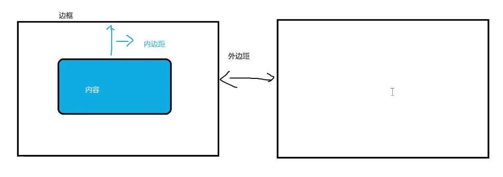

# Day1（HTML）

### 标题

> ```
> <h1></h1>一级标题
> ```

## 换行

> ```
> <br>换行
> ```

## 段落文本

> ```
> <p></p>
> ```

## 水平线

> ```
> <hr></hr>
> 属性
> color
> width
> align=“left”    #靠哪
> noshade 		#阴影
> ```

## 特殊符号

> 尖角号
>
> > 左尖角号：&lt；
> >
> > 右尖角号：&gt；
>
> 空格：&nbsp；   &emsp；
>
> 版权：&copy；
>
> 商标：&trade；       &reg；

## 块

> ```
> <div>默认独占一行
> <span>对于文本需要独立修饰的时候
> ```

## 列表

> 无序列表          快捷键   ui>li{2334}*4
>
> ```
> <ul>
> 	<li>无序列表</li>
> 	<li>无序列表</li>
> </ul>，
> type="disc"默认是实心，circle是空心，square是实心方块，none什么都没有
> ```
>
> 有序列表
>
> ```
> <ol type="A" start="4">
> 	<li>有序列表</li>
> 	<li>有序列表</li>
> </ol>
> ```
>
> 自定义列表
>
> ```
> <dl>
> 	<dt>可以是文字可以是图</dt>
> 	<dd>相关文字</dd>
> </dl>
> ```

## 图片

> ```
> 
> title="鼠标停留上的信息"
> alt=“图片加载不出来的信息”
> ```

## 超链接

> ```
> <a href="" title="鼠标停上去的提示信息" target=“规定在何处打开文档”>内容</a>
> target=“_blank”新窗口打开
> target="_self"默认值
> ```

## table表格

> ```
> <table>
> 	<tr>
> 		<td>1</td>
> 		<td>2</td>
> 	</tr>
> 	<tr>
> 		<td>3</td>
> 		<td>4</td>
> 	</tr>
> </table>
> ```
>
> ```
> 快捷键：table>tr*2>td*2
> table属性：
> boder="1"边框
> width=“500px”或“50%”（相对于父元素的一半）
> height="500px"或“50%”（相对于父元素的一半）
> align=“center或left或right”水平对齐
> bgcolor背景颜色
> bodercolor边框颜色
> cellspacing="单元格与单元格之间的间距"
> cellpadding=“单元格与内容之间的空隙”
> ```
>
> ```
> tr属性
> height高度
> bgcolor背景颜色
> align=“center或left或right”文字水平对齐
> valign=“top”或“middle”或“bottom”文字垂直对齐（上中下）
> ```
>
> ```
> td属性
> width宽度
> height高度
> bgcolor背景颜色
> align=“center或left或right”文字水平对齐
> valign=“top”或“middle”或“bottom”文字垂直对齐（上中下）
> ```
>
> ### 表格合并
>
> ```
> colspan="所要合并的单元格的吧*列数*"必须给td
> rowspan="所要合并的单元格的吧*行数*"必须给td
> ```

## 表单

> ```
> <form method="GET或者POST" ation=“向何处发送表单数据”>
> 	用户信息：<input type=“text” placeholder="请输入你的用户名" name="">
> 	<br>
> 	密码：<input type=“password” placeholder="请输入你的密码" name="">
> 	登录：<input type=“submit” value="登录" name="">
> </form>
> ```
>
> ```
> 文本框type="text"     
> 提交框type="submit"和<button>提交按钮</button>一样
> 按钮框type="button"
> 重置框type="reset"
> 密码框type="password"
> name属性必须设置,否则其中的数据传输不到服务器
> value
> ```

# CSS

## 外部样式

引入

```
<link rel="stylesheet" type="text/css" href="链接地址">
或者
<style>
	@import url(链接地址);
<style>
link属于XHTML标签，而@import是CSS提供的一种方式
最好使用link引入
```

## 行内样式

style直接写在标签后面

## 内部样式和外部样式优先级（面试题）

> **行内样式优先级>内部样式> 外部样式**
>
> **！important最高**

## 选择器

> ```
> <style>
> 	.ibm{
> 	background-color:red;
> 	}
> 	.qinfeng{
> 	color:red;
> 	}
> </style>
> <div class="ibm qinfeng">fjka</div>
> <div class="ibm">fjkfafjaia</div>
> ```
>
> id选择器(具有唯一性)
>
> > ```
> > <style>
> > 	#ibm{
> > 	background-color:red;
> > 	}
> > </style>
> > <div id="ibm">fjka</div>
> > ```
>
> 通配符*
>
> > ```
> > <style>
> > 	*{
> >         margin:0;   #外边距
> >         padding:0;	#内边距
> > 	}
> > </style>
> > ```
>
> 群组选择器
>
> > ```
> > div,p,h1{
> > 
> > 	background-color:red;
> > 
> > }
> > ```
> >
> > 
>
> 后代选择器(div里面的p标签)(包含选择器)
>
> > ```
> > div p{
> > 
> > 	background-color:red;
> > 
> > }
> > <div>
> > 	<p>fhajhfah</p>
> > </div>
> > 
> > div>p{
> > 					#选中的是div下的亲儿子，孙子都选不了
> > }
> > ```
>
> **伪类选择器(a链接)**顺序不可变（重点）
>
> > ```
> > a：link{
> > 	color:red;				#初始显示状态
> > }
> > a：visited{
> > 	color：yellow；			#访问之后的状态
> > }
> > a:hover{
> > 	color:blue；				#鼠标悬停时的状态
> > }
> > a：active{
> > 	color：green；			#点击激活时的状态
> > }
> > ```

## 选择器的权重（面试重点）

**!important>内联样式>包含选择器>id>class>元素**

## CSS属性

> **文本属性**
>
> > font-size :字体大小		默认16px
> >
> > font-family：字体         默认微软雅黑，多个字体中间用逗号链接，先解析第一个，后第二个，以此类推退
> >
> > color：颜色  可以使用rgb（0，0，255）
> >
> > font-weight: 				取值100-900，100细体，400正常，700加粗，900或者light，normal，bold,bolder
> >
> > font-style					italic（斜体字）oblique（更倾斜）normal（正常）
> >
> > text-align					center，left，right，justify（两端对齐）
> >
> > line-height				  行高		
> >
> > letter-spacing			字符间距
> >
> > word-spacing			词间距
> >
> > text-indent:2em		首行缩进两个字符
> >
> > text-decoration		underline（下滑线）  line-through（删除）overline(上划线)	none(没有下划线通常在超链接里使用)
> >
> > text-transform			capitalize（首字母大写）lowercase（全部小写）uppercase（全部大写）
>
> **列表属性**（最常用list-style：none；）
>
> > list -style-type		定义列表样式	disc实心圆   circle空心圆   square实心正方形  none无
> >
> > list-style-image：url（）；			用图片来定义
> >
> > list-style-position:inside				将前方的图片并入
> >
> > list-style：none url（imag/1.jpg），inside；	
>
> **背景属性** 
>
> background-color：
>
> background-image：url()				默认图片时平铺效果
>
> background-repaeat:repeat-x		repeat-x:x轴平铺   repeat-y：y轴平铺   no-repeat不平铺
>
> background-position：20px 20px；   left/center/right    top/center/bottom			
>
> background-size：						背景尺寸   cover（覆盖）
>
> background-attachment：fixed			固定在浏览器左上角 	**视差效果**
>
> background:url(img/1.jpg) no-repeat center fixed yellow;

# Day2  (CSS)

## 浮动属性

>  float：left;  				left   right    none
>
> 最大的作用是让竖着的东西横着来
>
> 其次是让其他文本如何环绕该元素显示
>
> **解决高度塌陷（面试重点）**
>
> 1. 写固定高度(高度写死)
>
> 2. 清除浮动
>
>    > clear:left     right     	none  	both(左右浮动都清除)     加在最后一个元素身上
>
> 3. 当前浮动元素后面补一个盒子，不设置宽高                  加在前两个元素后面
>
> 4. overflow:hidden;			#让浮动元素计算高度            加在前两个元素后面

## 盒子模型



> padding：           			#内边距  
>
> > 设置一个值，四个方向一样
> >
> > 设置两个值，上下，左右
> >
> > 设置三个值，上，左右，下
> >
> > 设置四个值，上，右，下，左（顺时针）
> >
> > 背景色可以蔓延到内边距
> >
> > 设置单一方向:padding-top   padding-bottom  padding-left  padding-right
>
> boder：10px  solid red 					#边框（solid  double  dashed线状 dotted点状）
>
> >  boder可以拆分成三中属性，都可以四个方向设置
> >
> > boder-width			
> >
> > boder-style
> >
> > boder-color
>
> margin:                          #外边距
>
> > 设置一个值，四个方向一样
> >
> > 设置两个值，上下，左右
> >
> > 设置三个值，上，左右，下
> >
> > 设置四个值，上，右，下，左（顺时针）
> >
> > 背景色不可以蔓延
> >
> > 设置单一方向:padding-top   padding-bottom  padding-left  padding-right
> >
> > 外边距支持负值
> >
> > 屏幕居中   margin：0 auto;
> >
> > 特性问题
> >
> > > 1. 兄弟关系，两个盒子垂直外边距与水平外边距问题
> > >
> > >    > 垂直方向取最大值
> > >    >
> > >    > 水平方向会合并处理
> > >
> > > 2. 父子关系，给子盒子加边距，结果加到了父盒子怎么解决
> > >
> > >    > 1. 给父盒子加内边距（会导致盒子增加宽度，应该注意高度计算）
> > >    > 2. 给父盒子设置边框（会导致盒子增加宽度，应该注意高度计算）
> > >    > 3. 给子盒子或父盒子加浮动
> > >    > 4. overflow：hidden
>
> ### PS使用技巧
>
> 
>
> 
>
> 

## 溢出属性

> overflow:取值            
>
> > 默认:visible（显示溢出）
> >
> > hidden（溢出隐藏，文本裁切）  
> >
> > scroll（有滚动条） 
> >
> > auto（内容多有滚动条，内容少就没有滚动条）
> >
> > inherit（继承父元素的效果）
>
> overflow-x：		#对于x轴
>
> overflow-y:			#对于y轴
>
> white-space:
>
> > nowrap 		#不换行（最常用）
> >
> > pre				#显示空格，回车，不换行
> >
> > pre-wrap		#显示空格，回车，换行
> >
> > pre-line			#显示回车，不显示空格，换行
> >
> > 文本太长显示...
> >
> > white-space:nowrap;
> >
> > overflow:hidden;
> >
> > text-overflow:ellipsis;

## 元素显示类型

块元素：div   p	h1	ul	

特点

> 均自带display:block;或者display：list-item；
>
> 注意：p标签内不能放块级元素，可以放文本

行内元素	b	em	span	strong

> 均自带display：inline
>
> 不可以设置行宽
>
> 只能设置左右边距，不能设置上下边距

行内块元素	img	input

> display:inline-block
>
> 可以设置行宽
>
> 可以在一行中显示

如何将行内元素变为块元素**（面试重点）**

> 1. display-block
> 2. absolute
> 3. float:left

## 定位

> position:static							默认
>
> position:absolute					绝对定位
>
> position:relative						相对定位
>
> position:fixed							固定定位
>
> position:sticky							粘性定位

absolute

> 当没有父子关系时，设置了绝对定位，相对于浏览器第一屏左上角
>
> 当有父子关系时，当父亲设置了相对定位，儿子设置了绝对定位，则儿子相对于父亲

fixed

> 相对于浏览器窗口

sticky

> position:sticky
>
> top:0；
>
> 可以吸顶效果
>
> 对于旧版本浏览器可能不兼容

relative

> 相对于原来的位置

## 定位里的层级

定位使两个块交叉了，谁的层级大，显示谁

z-index:100;			#z-index值越大，层级越大

父子绝对定位，将子盒子设置成负值，则层级可以显示

兄弟绝对定位，层级不受影响

##  定位控制元素垂直方向居中（面试题）

浏览器绝对定位

position:absolute;

top:50%;

left:50%；

margin-lift:-100px										#该值取盒子的一半

margin-top:-100px;										#该值取盒子的一半

## 定位与浮动区别（面试重点）

浮动半脱离文档流，会出现文字环绕

absolute：全脱离，不会出现文字环绕

## 锚点

锚点作用：页面不同区域的跳转，使用a链接

```
<a href="#锚点名字"></a>    要加#
<div id="锚点名字"></div>
```

## 精灵图

可以将很多小图标合并成一张大图，然后用background-position去调整背景位置，以节省图片加载资源

background-position：-205px -100px;

## 块级元素宽高自适应

定义元素的宽和高，不能写死，希望元素根据窗口和子元素自动调整

宽度\高度不写或者width：auto就是自适应

可以设置一个最小高度

也可以设置一个最大高度 

min-height:

max-heght:

窗口自适应

html，body{

​	height:100%

}

.box{

​	height:100%

​	width：100%

}

**解决高度塌陷（面试重点）**

1. 写固定高度(高度写死)					#缺点：去过浮动过多，换行，就会出现问题

2. 清除浮动                                        	#缺点：增加空标签，不利于代码可读性  

   > clear:left     right     	none  	both(左右浮动都清除)     加在最后一个元素身上

3. 当前浮动元素后面补一个盒子，不设置宽高                  加在前两个元素后面

4. overflow:hidden;			#让浮动元素计算高度            加在前两个元素后面    会隐藏溢出元素

5. 加一个伪元素

   .box::after{

   ​	content:"";

   ​	display:block;					#默认content是行内元素，加这一行保证其为块级元素

   ​	width:0;

   ​	height:0;

   ​	visibility:hidden;				#让元素不显示内容

   }

同样是隐藏内容，他俩有什么区别

display：none;			#不占位隐藏，下面元素会顶上去

visibility:hidden；		#占位隐藏，下面元素不会顶上去

 ## 两栏布局

```
.box1{
	width:200px;
	height:100%
	background:red;
	float:left;
}
.box2{
	width:clac(100% - 200px);			#减号两边必须有空格
	height:100%
	background:yellow;
}
html，body{

​	height:100%

}
```

## 三栏布局-可以设置成弹性盒

```
.box1{
	width:200px;
	height:100%
	background:red;
	float:left;
}
.box2{
	width:clac(100% - 400px);			#减号两边必须有空格
	height:100%
	background:yellow;
	float：left
}
.box3{
	width:200px;
	height:100%
	background:red;
	float:right;
}
html，body{

​	height:100%

}
```

## 表单进阶

以下内容都加在<form></form>下

单选框

> <input type="radio" name="aaa" chacked> 非常满意  
>
> <input type="radio" name="aaa" > 满意  
>
> <input type="radio" name="aaa" > 一般
>
> <input type="radio" name="aaa" > 不满意
>
> name="aaa"目的为了完成单选
>
> chacked默认选中
>
> <input type="radio" name="bbb" id="man">
>
> <label for="man">男</label> 
>
> <input type="radio" name="bbb" id="woman">
>
> <label for="woman">女</label>
>
> <label for="man">目的为了点文字也可以选中 

复选框

> <input type="checkbox" name="aaa" > 抽烟
>
> <input type="checkbox" name="aaa" >喝酒
>
> <input type="checkbox" name="aaa" >烫头

上传文件

> <input type="file" name=""  id="">
>
> <input type="hidden" name=""  id=""  valur="带给后端个人信息">
>
> ```
> <button disabled="disabled">注册</disabled>
> <input type="text" disabled>				#禁用该按钮或是禁用该文本框
> <input type="text" readonly value="222">	#只读
> ```

下拉菜单

```
<select size=3 mult>				#size可以显示几个下拉菜单
	<option>辽宁</option>
	<option>山东</option>
	<option>河北</option>
	<option>河南</option>
	<option>山西</option>
</select>
<select size=3 multiple>				#multiple可以多选，安卓shift或者ctrl
	<option>桌子</option>
	<option>椅子</option>
	<option>电脑</option>
	<option>板凳</option>
	<option>柜子</option>
</select>
option支持的属性
1、value，提交给后端需要用的value值
2、selected，默认选中的选项
```

文本域

```
<textarea cols="10"  rows="20"  placeholder=“请输入你的意见”>提前设置好的value</textarea>  	
#cols列数rows行数  placeholder文本域内可以预置提示的内容
textarea不要换行
<style>
	textarea{
		width:300px;
		height:300px;
		resize:horizontal;			
	}
</style>
#resize重新设置大侠默认是both，垂直水平方向都可以拉伸，vertical垂直方向可以拉伸，horizontal水平方向可以拉伸，none任何方向都不可以拉伸
```

# DAY3字段集


```
<fieldset>
	<legend>性别</legend>
	<input type="radio" name="aa">男
	<br>
	<input type="radio" name="aa">女
</fieldset>
```

## H5新增语义化标签


## H5音频

```
<audio src="" controls></audio>
属性：
controls		#控制
loop			#循环
autoplay		#自动播放
muted			#静音播放
```

## H5视频

```
<video src="" controls ></video>
controls		#控制
loop			#循环
autoplay		#自动播放
muted			#静音播放
poster=""		#海报
width
height
```

## 增强表单

```
<form action="">
	<input type="color" name="color">			#颜色选择并提交
	<input type="submit">
</form>
	<input type="email" name="myemail">			#邮箱
	<input type="url">							#地址
    <input type="tel">							#电话号码，手机端
    <input type="range" name="range" min="100" max="300" value="100" step="10">			#滑块效果，滑块最小是100，最大是300，默认是100,步长是10
    <input type="number" min="0" max="10" value="5" step="2" name=“age”>					#只能输入数字最小是0，最大是10，默认是5,步长是2
    <input type="search">						#搜索
    <input type="date">							#日期
    <input type="month">						#月份
    <input type="datetime-local" name="time">	#本地时间
    想要提交后端，就要有name属性
```

## 增强表单-数据列表


```
选项列表（支持模糊搜索）
<input type="text" list=“mylist”>
<datalist id="mylist">
	<option value="">手机</option>
	<option value="">手表</option>
	<option value="">手环</option>
	<option value="">手镯</option>
</datalist>

```

## 增强表单-属性

```
autofocus			#聚焦焦点（页面一打开，鼠标默认在哪个文本框中）
required				#必填项、表单必须填写
mutiple					#支持多个地址，用逗号隔开
pattern=[1-9][a-z]{3}			#正则表达式，必须是1个数字三个字母
```

## CSS3选择器

### 层级选择器

> ```
> 
> 子代选择器(>)
> .box>li
> 
> + 当前元素的后面的第一个兄弟(必须是兄弟关系)
> ~ 当前元素的后面的所有兄弟(必须是兄弟关系)
> .child+li
> .child~li
> ```

### 属性选择器

```
把所有是class或者name或者type等等属性的选择出来
[class]{
	background:red;
}			#指定属性名选择出来
div[class]{
}			#div必须有class属性
input[name]{
}
input[type=password]{
}			#指定属性名，并指定属性值选择出来	
div[class~=box1]{
}			#class属性中只要包含box1就可以


不太常用的
只包含某个字母的（模糊匹配）
class^=b    开头只要是b的就模糊匹配
class$=b	结尾只要是b的就模糊匹配
class*=b	只要内容中包含b就可以模糊匹配
div[class^=b]{
}
```

### 伪类选择器

```
li:first-child{}

ul li:lastchild{}

li:nth-child(n){}				#n可以取任意数字

li:nth-child(2n){}		或者li:nth-child(even){}	#li下任意偶数个的选中

li:nth-child(2n+1){}	或者li:nth-child(odd){}	 #li下任意偶数个的选中

div p:only-child{
	background:yellow;		#div下p标签只有一个孩子的
}
div:empty{
	background:yellow;		#div下没有孩子的，必须一点东西都没有，连空格都不行
}
：root可以代替html
```

### 目标伪类选择器

div：target{

​	background：yellow；

}

手风琴效果


```
<style>
	div.content{
		display:none;
	}
	div.content:target{
		display:block;
	}
</style>
<div>
	<a href="#aaa">aaa</a>
	<div id="aaa" class=content>
		kfajaljflajfoiafoiaofi
	</div>
</div>
<div>
	<a href="#bbb">bbb</a>
	<div id="bbb" class=content>
		kfajaljflajfoiafoiaofi
	</div>
</div>
<div>
	<a href="#ccc">ccc</a>
	<div id="ccc" class=content>
		kfajaljflajfoiafoiaofi
	</div>
</div>
```

### UI元素状态伪类选择器

input：enabled{

}		#匹配用户界面（form）中处于可用状态的input元素

input：disabled{

}		#匹配用户界面（form）中处于不可用状态的input元素

input：checked{

}		#匹配用户界面（form）中选中状态的input元素

input：selection{

}		#匹配input元素中被用户选中或处于高亮状态的部分

### 否定伪类选择器

li：not:(nth-child(2n)){

}		选定不是偶数的，即奇数

### 动态伪类选择器

a：link{
	color:red;				#初始显示状态
}
a：visited{
	color：yellow；			#访问之后的状态
}
a:hover{
	color:blue；				#鼠标悬停时的状态
}
a：active{
	color：green；			#点击激活时的状态
}

## 文本阴影css

text-shadow:20px 30px 1px red;

20px   水平方向阴影程度

30px   垂直方向阴影程度

1px	 模糊程度

red	阴影颜色

支持多个方向不同颜色的阴影

text-shadow:0px -10px 1px red，0px 10px 1px yellow；

## 盒子阴影

box-shadow:20px 30px 1px red ;

可加个inset（内阴影）

## 圆角边框

boder-radius：10px；

boder-radius：10px 10px；

boder-radius：10px 10px 10px 10px；

可选px，也可以选择%

v1			#四个角一样			（一个值）

v1 v2       #左上右下，左下右上（两个值）

v1 v2 v3 v4 #顺时针（四个值）

变成圆（盒子必须是圆）

border-radius：设置成盒子的一半（盒子算上必须边框）

也可以写成border-radius：50%；


用的少的

border-top-left-radius：10px；		左上

border-top-right-radius：10px；		右上

border-bottom-left-radius：10px；	左下

border-bottom-right-radius：10px；	右下

border-radius:30px/60px;		#水平30，垂直60；

## 字体引入

@font-face{

​	font-family:linian;

​	src:url();

}

​	div{

​	font-family:linian;

​	font-size:50px;

}

## 怪异盒模型

box-sizing：border-box；

设置边框向内挤压占据空间

## 弹性盒

display：flex；			

影响：

> 默认使盒内元素横向排列
>
> 如果子元素是行内元素，使其变成块级元素
>
> 只有一个元素是，margin：auto自动居中

修改默认排列方式

flex-direction：column；		#默认水平方向排列，变成默认垂直方向排列

flex-direction：row-reverse；	#使水平方向反着来从右到左排列

```
调整主轴对齐方式
justify-content：flex-start；
#flex-start默认左对齐    flex-end右对齐  center居中对齐   space-between 两边对齐
space-around距离环绕（自身两边距离一样）

调整侧轴方向对齐方式
align-items:center
#flex-start默认左对齐    flex-end右对齐  center居中对齐   space-between 两边对齐
space-around距离环绕（自身两边距离一样）
```


```
弹性盒默认会在一行进行挤压，当内容过多时，需要折行

flex-wrap：wrap；折行

align-content:flex-start;     #调整折行后的行间距
#flex-start默认左对齐    flex-end右对齐  center居中对齐   space-between 两边对齐
space-around距离环绕（自身两边距离一样）
```

## 项目对齐方式

给盒子内的每一个小盒子（项目）设置对齐

align-self：

align-self:flex-start;     #调整折行后的行间距
#flex-start默认左对齐    flex-end右对齐  center居中对齐   baseline和start一样

```
调整项目顺序

order：；

默认取值时0，数值越大排列越靠后
```

## 剩余宽高（实现两栏布局或者三栏布局）


flex：1占满剩余空间

## 多列布局


colum-count：5			#显示的列数

column-gap:30px			#调整列间距

column -rule：2px  soild red;			#列边框

column-fill:balance				#列高度同一，取值auto父盒子占满				

column-width:50px				#调整列宽

div>h1{

​	column-span:all;

​	text-align:center;

}

## em与rem

px：50px；

em:相对单位，相对父元素的字体大小，div width：10em；

rem：相对单位，相对根元素（html）字体大小，div width：10rem；

## vh vw

vh是view-height的缩写

vw是view-width的缩写

 100vh==视口的高度

100vw==视口的宽度

## 渐变

### 线性渐变

background:linear-gradient(to top,red ,yellow,green)

支持多颜色渐变

支持方向：to top 向上渐变     to bottom 向下渐变

​					to left像左渐变	  to right  向右渐变

支持角度：90deg

### 径向渐变

> background:radial-gradient()

### 重复渐变

> background:repeat-gradient()

## 网格布局

display:grid;		块级网格

display:inline-grid;			行内块级网格


minmax

grid-template-rows:minmax(100px,200px)  200px  300px;

grid-template-columns:200px 200px 200px;


auto

grid-template-rows:auto 200px  300px;

grid-template-columns:200px auto 200px;


### 对齐方式

grid-auto-flow:colum;				改变顺序方向，向下


